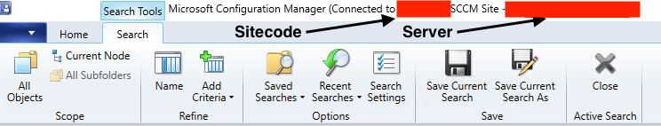
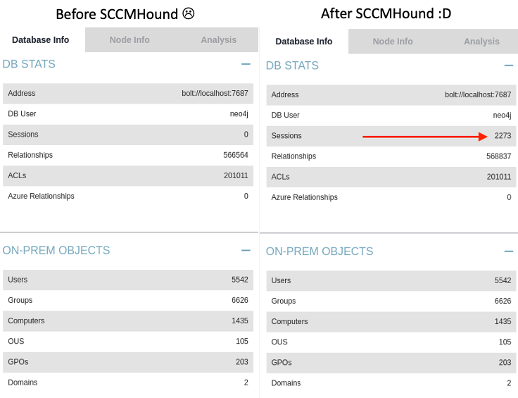
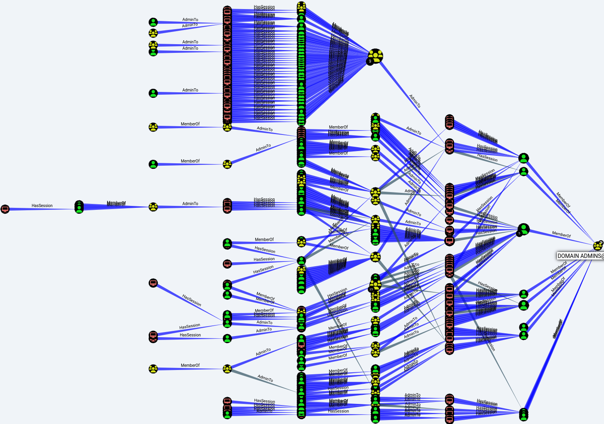

# SCCMHound
SCCMHound is a C# BloodHound collector for Microsoft Configuration Manager (MCM). If you're looking for a way to collect BloodHound session information from Configuration Manager's users and computers then this is the tool for you!

Highly recommend importing collected data with another collector's data (SharpHound, SOAPHound, etc.). Doesn't matter whether it's imported before or after another dataset. This results in an extensive overview of the target organization's Active Directory relationships, supplemented by information collected from Configuration Manager.

## Support Statement
SCCMHound is an open source project, not a CrowdStrike product. As such, it carries no formal support, expressed or implied.

## Requirements
SCCMHound targets .NET 4.6.2 to ensure compatibility with Windows 10 versions 1607 and above. 

An MCM administrator account is required with sufficient access to query user and computer information. Depending on the collection method, the ability to execute CMPivot queries is also required. This tool has been tested with a user assigned the MCM "Full Administrator" role.

The server and site code can be retrieved from the MCM console, or using another tool such as SharpSCCM.


## How do I build it?
First, you'll need to clone the repository. `--recursive` must be specified as SCCMHound uses SharpHoundCommon as a submodule.

e.g. `git clone git@github.com:CrowdStrike/sccmhound.git --recursive`

Once you have a local copy, open `SCCMHound.sln` in Visual Studio and compile!

## How do I run it?
To use the default collection method, simply supply a server and sitecode argument. SCCMHound will use the execution context that it is invoked from to authenticate to MCM. For example:
```
SCCMHound.exe --server <server> --sitecode <sitecode>
```

To execute SCCMHound from another user's context or a non domain-joined machine, the `-u` (`--username`), `-p` (`--password`), and `-d` (`--domain`) arguments are required. For example:
```
SCCMHound.exe --server <server> --sitecode <sitecode> -u <username> -p <password> -d <domain>
```

Alternatively, `runas /netonly` can be used prior to invoking SCCMHound:
```
runas /netonly /user:user@domain.tld cmd.exe
cd C:\path\to\SCCMHound
SCCMHound.exe --server <server> --sitecode <sitecode>
```

## Why is this useful?
Remember when BloodHound session data was easy to collect? Well...


Pretty credential theft and lateral movement graphs!!!


## Who can I blame for this monstrosity?
[Authors and Contributors](AUTHORS.md)

Please be kind whilst the maintainer/s expands collected data sources and irons out any bugs :)

## I just want to run this and collect everything!!!
Okay, okay... This will invoke all the collection methods (including CMPivot collection methods):
```
SCCMHound.exe --server <server> --sitecode <sitecode> -c All
```

## CLI Arguments
```
  --server                   Required. SCCM server hostname/IP address.

  --sitecode                 Required. SCCM sitecode.

  -c, --collectionmethods    (Default: Default) (LocalAdmins, CurrentSessions, All)

  --loop                     (Default: false) Enable loop collection.

  --loopduration             (Default: 00:30:00) Loop Duration.

  --loopsleep                (Default: 60) Sleep time between loops in seconds.

  --hc                       (Default: false) Health check. Simply tests authentication and exits.

  -u, --username             SCCM administrator username.

  -p, --password             SCCM administrator password.

  -d, --domain               SCCM administrator domain.

  -v, --verbose              (Default: false) Print verbose information to help with troubleshooting.

  --help                     Display this help screen.

  --version                  Display version information.
```

## Collection Methods
### Default
The default collection method (no `-c` argument specified/required) constructs a BloodHound dataset using only WMI connections to the specified MCM site server. This collection method will collect:

- Domains in MCM's dataset
- Users in MCM's dataset
- Groups in MCM's dataset
- Computers in MCM's dataset

This collection method collects currently logged on user information for each Computer object in MCM. This has the limitation of only collecting the MCM reported logged on user regardless of whether multiple users are authenticated.

SCCMHound automatically populates Group membership for Users ONLY. Group objects in ConfigMgr do not appear to contain child group or parent group information so groups in BloodHound will only show User members. This requires further investigation and is not an issue if importing with another dataset (SharpHound, SOAPHound, etc).

To obtain greater session coverage using this collection method, the `--loop` argument can be used to regularly collect session information.

## LocalAdmins (CMPivot Mechanism)
This collection method (`-c LocalAdmins`) executes the "Default" collection method's behaviour, and also queries the "All Systems" collection to collect the contents of the local `Administrators` group for every MCM-managed computer.

Note (1): This collection method only queries devices that are online. It can be used with the `--loop` argument to obtain better coverage.
Note (2): This collection method uses CMPivot to execute the query on all members.

## CurrentSessions (CMPivot Mechanism)
This collection method (`-c CurrentSessions`) executes the "Default" collection method's behaviour, and also queries the "All Systems" collection to collect real-time session information for every MCM-managed computer.

This collection method only queries devices that are currently online. It can be used with the `--loop` argument to get better coverage.

Note (1): This collection method only queries devices that are online. It can be used with the `--loop` argument to obtain better coverage.
Note (2): This collection method uses CMPivot to execute the query on all members.

## All Collection Methods
To run all collection methods in one go, simply specify All (`-c All`) for the collection method

# Information Regarding CMPivot Based Collection Methods
I'd recommend reading the following Microsoft documentation to get a better understanding of how CMPivot works:
https://learn.microsoft.com/en-us/mem/configmgr/core/servers/manage/cmpivot

tl;dr - CMPivot collection methods have been tested by Microsoft in environments with up to 50,000 clients which generated <50MB of traffic across the network. SCCMHound's collection methods have been tested in environments with ~1000 machines with no identified issues or service degradation.

Feel free to report any feedback regarding these collection methods in large environments so that it can be incorporated here.

# How can I use this dataset?
In addition to excellent session and local Administrator coverage, SCCMHound populates collected objects with additional properties. These can be observed in the "Node Info" tab in Bloodhound, prepended with "sccm". For e.g. `sccmADSiteName`.

Collected properties include:
- SCCM decomissioned status
- Reported IP addresses for computers (IPv4 and IPv6)
- Last logon timestamp
- Domain that last logged in user was a member of
- Name of the user that was last logged on
- Enumerated sessions that were unresolvable (could not create a corresponding BloodHound object, examples include local accounts)

# Custom BloodHound Queries for SCCMHound Datasets
[customqueries.json](customqueries.json) provides Cypher queries that can be executed with an imported SCCMHound dataset. This will be expanded as additional functionality is added to SCCMHound.

To use this, simply copy `customqueries.json` to `~/.config/bloodhound/customqueries.json` and restart BloodHound. The queries will then appear under the BloodHound "Analysis" tab.